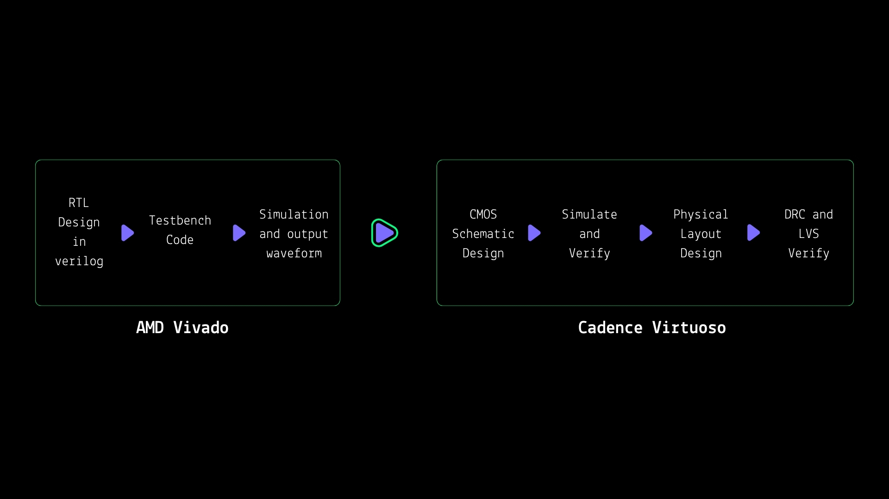

# Custom-RTL-to-CMOS-layout
Complete Verilog-to-CMOS physical layout implementation of a Boolean function. RTL simulation in Verilog/Vivado and complete schematic-to-layout implementation in Cadence Virtuoso, including DRC and LVS verification.

# Workflow
This project demonstrates the complete design flow from RTL functional verification to transistor-level CMOS implementation and physical layout verification. I have taken a random boolean function - ((A+B).C.D)' then wrote RTL code to simulate the function before I design it in CMOS logic. I wrote RTL code and simulated the function using Vivado. Then designed the CMOS logic circuit in Virtuoso. After that I simulated the CMOS logic circuit in ADE L , Virtuoso. Both the output waveform from RTL code and CMOS circuit matched. Then I went for physical layout design. The final layout has 0 DRC error with LVS matched.

# Resources

RTL Code:  [random_func_1.v](Verilog_codes/random_func_1.v)

Testbench Code:  [tb_random_func_1.v](Verilog_codes/tb_random_func_1.v)

RTL schematic:  [random_func_1_schematic_vivado.JPG](Images/random_func_1_schematic_vivado.JPG)

RTL Simulation:  [random_func_1_op.JPG](Images/random_func_1_op.JPG)

CMOS Schematic:  [random_func_1_cmos_virtuoso.JPG](Images/random_func_1_cmos_virtuoso.JPG)

CMOS Simulation Schematic: [random_func_1_sim_virtuoso.JPG](Images/random_func_1_sim_virtuoso.JPG)

CMOS Simulation Output: [random_func_1_op_virtuoso.JPG](Images/random_func_1_op_virtuoso.JPG)

Physical Layout: [random_func_1_layout_virtuoso.JPG](Images/random_func_1_layout_virtuoso.JPG)

DRC : [random_func_1_DRC_virtuoso.JPG](Images/random_func_1_DRC_virtuoso.JPG)

LVS : [random_func_1_LVS_virtuoso.JPG](Images/random_func_1_LVS_virtuoso.JPG)
